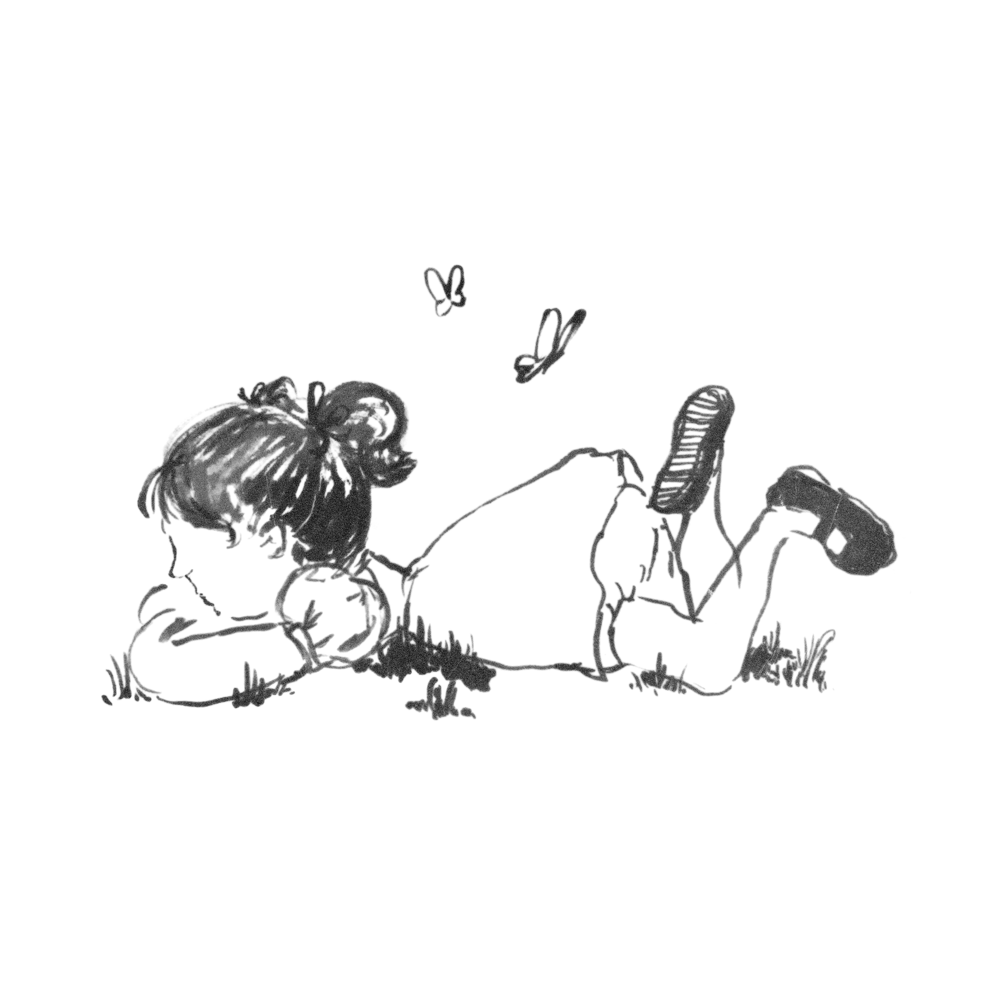
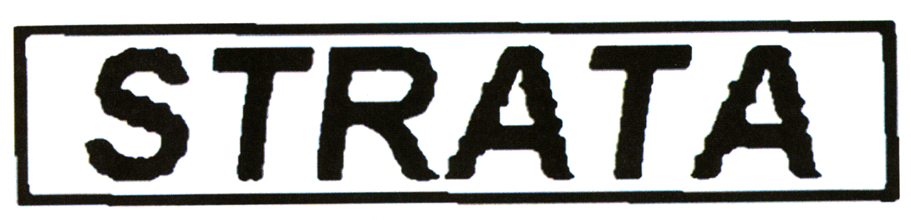

▮ Umwelt EP
Onas Ueno
 
▮ Release Date: **05.09.2025**
[Private Streaming Link](https://on.soundcloud.com/IRJKTqzyTw0RrKJOHv) (*Please do not share*)
[Private Download Link](https://drive.google.com/drive/folders/1dkPF0S0om1bNitojJD--bZ2Ng0SwfgGL?usp=sharing) (*Please do not share*)
 

---
  
*Across its runtime, Onas Ueno builds immersive soundscapes that shift and fracture like thoughts mid-formation. Blending ambient atmospheres, digital dissonance and tactile textures, Umwelt sketches a fragmented world; half hyper-real, half doodle. The title, Umwelt, borrowed from the German term for ‘the world as experienced by a particular organism’, serves as a guiding principle in the formation of the songs, allowing the sounds to evolve with a sense of self-determination.*

  
▮ Tracklist
1. Too Ghost To Body
2. Lo
3. Every Dread Delight
4. Qualia
5. Tools For A Second
6. What Angels

 
  
▮ Credits
Written and Produced: **Jonas Pequeno**
Mixing Engineer: **Jonas Pequeno**
Master Engineer: **Conor Dalton**
Cover Design: **Amelia Galliford**
 
  
▮ Artist Bio
Onas Ueno is a London-based multidisciplinary artist.
 
▮ For all enquiries, please contact: **strata.edition@gmail.com**
 
 

